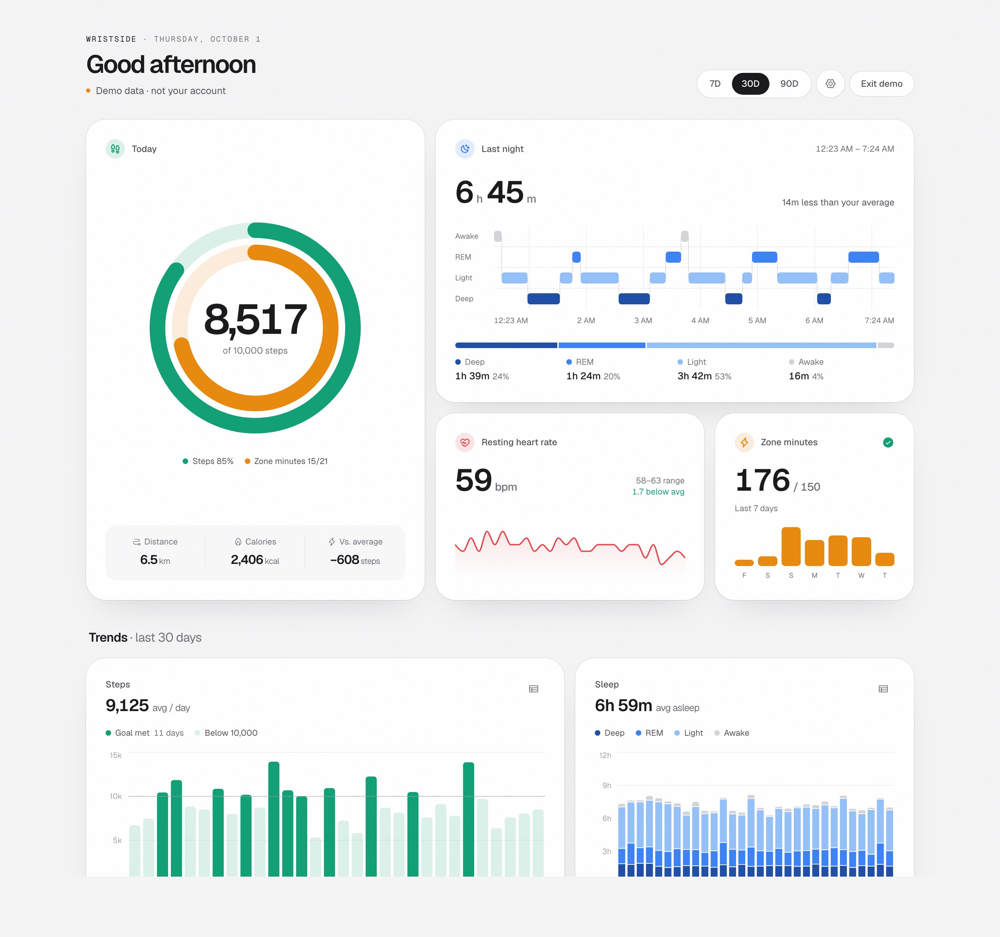
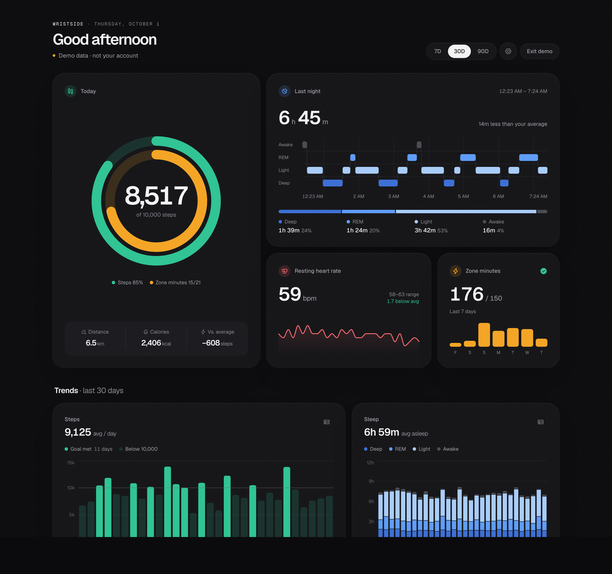

# Wristside

**An open-source web dashboard for your Fitbit data.**

Google retired the fitbit.com dashboard in 2024, and the Google Health app that replaced the
Fitbit app is phone-only. Wristside puts your steps, sleep stages, resting heart rate, Active
Zone Minutes and workouts back on a big screen, in any browser.



<details>
<summary>Dark theme</summary>



</details>

## Features

- **Today at a glance**: step and Active Zone Minutes rings, distance and calories.
- **Sleep hypnogram**: last night's stages over time, plus a stage breakdown.
- **Trends** for 7, 30 or 90 days: steps against your goal, sleep stages, resting heart rate,
  Active Zone Minutes. Every chart has a table view.
- **Workouts** with per-activity icons, duration, calories and average heart rate.
- **Your goals and units**: set step and weekly zone goals, kilometers or miles.
- **Light and dark** themes that follow your system, and reduced motion support.
- **Private by design**: no database, no analytics. Your OAuth tokens live in an encrypted,
  http-only cookie in your own browser, and data goes straight from Google to you.

Works with any tracker that syncs to Google Health (Fitbit Air, Charge, Inspire, Versa, Sense,
Pixel Watch). It reads data through the [Google Health API](https://developers.google.com/health).

## Getting started

Wristside is **self-hosted**: you run your own copy with your own Google Cloud credentials. This
is a one-time setup of about 10 minutes, and it means nobody else ever handles your health data.

### 1. Create Google credentials

1. [Create a Google Cloud project](https://console.cloud.google.com/projectcreate).
2. Enable the [**Google Health API**](https://console.cloud.google.com/apis/library) for it.
3. Open the [OAuth consent screen](https://console.cloud.google.com/auth/overview) and click
   *Get started*:
   - Pick any app name and use your email for the contact fields.
   - Audience: **External**. Leave the app in **Testing** and, under *Test users*, add the Google
     account your tracker is linked to.
   - Data access: add these scopes:
     - `https://www.googleapis.com/auth/googlehealth.activity_and_fitness.readonly`
     - `https://www.googleapis.com/auth/googlehealth.health_metrics_and_measurements.readonly`
     - `https://www.googleapis.com/auth/googlehealth.sleep.readonly`
4. Under [Clients](https://console.cloud.google.com/auth/clients), create a client of type
   **Web application** and add an authorized redirect URI:
   - running locally: `http://localhost:3000/api/auth/callback`
   - deployed: `https://<your-domain>/api/auth/callback`

   Keep the client ID and client secret.

### 2a. Run it on your computer

Requires [Node.js](https://nodejs.org) 20.9 or later.

```bash
git clone https://github.com/samiamjidkhan/wristside.git
cd wristside
npm install
cp .env.example .env.local   # then fill in the values below
npm run dev
```

Open <http://localhost:3000> and click **Connect Google Health**.

### 2b. Or deploy your own copy to Vercel

[](https://vercel.com/new/clone?repository-url=https%3A%2F%2Fgithub.com%2Fsamiamjidkhan%2Fwristside&project-name=wristside&repository-name=wristside&env=GOOGLE_CLIENT_ID,GOOGLE_CLIENT_SECRET,SESSION_SECRET&envDescription=Google%20OAuth%20client%20credentials%20and%20a%2032%2B%20character%20random%20session%20secret&envLink=https%3A%2F%2Fgithub.com%2Fsamiamjidkhan%2Fwristside%23configuration)

After deploying, add `https://<your-project>.vercel.app/api/auth/callback` as a redirect URI on
your Google OAuth client. Wristside picks up your Vercel production domain automatically. Set
`APP_URL` only if you use a custom domain.

Your deployment is public on the internet, but only the test users you listed on your Google
consent screen can sign in. For extra safety, turn on
[Vercel Deployment Protection](https://vercel.com/docs/deployment-protection).

### Configuration

| Variable | Required | Description |
| --- | --- | --- |
| `GOOGLE_CLIENT_ID` | yes | OAuth client ID from step 1. |
| `GOOGLE_CLIENT_SECRET` | yes | OAuth client secret from step 1. |
| `SESSION_SECRET` | yes | Random string of 32+ characters used to encrypt the session cookie. Generate one with `openssl rand -base64 32`. |
| `APP_URL` | no | Public URL of the app. Defaults to `http://localhost:3000`, or your Vercel production domain on Vercel. |
| `DEMO_ONLY` | no | Set to `1` to serve sample data only, with sign-in disabled. Useful for a public showcase. |
| `NEXT_PUBLIC_REPO_URL` | no | Repository linked from the footer. Defaults to this repo; set it if you maintain a fork. |

Want to look around first? Click **View demo** on the start page to explore with sample data.

## Good to know

- **Weekly sign-in.** Google expires refresh tokens for apps in *Testing* mode after 7 days, so
  you'll be asked to connect again about once a week. Publishing the app removes this, but the
  health scopes are *restricted*, and publishing requires Google's verification and a security
  assessment.
- **Freshness.** Wristside shows whatever the Google Health app has synced. Open the phone app
  to force a sync.
- **Not shown yet:** HRV, SpO₂, breathing rate, VO₂ max and weight are available in the API.
  Contributions welcome.

## How it works

Next.js App Router app, with no database.

| Piece | Where |
| --- | --- |
| OAuth sign-in and token refresh | `src/lib/google-oauth.ts`, `src/app/api/auth/*` |
| Encrypted cookie session ([iron-session](https://github.com/vvo/iron-session)) | `src/lib/session.ts` |
| Google Health API client | `src/lib/health-api.ts` |
| Dashboard endpoint (`/api/dashboard?days=7\|30\|90`, `&demo=1`) | `src/app/api/dashboard/route.ts` |
| Sample data | `src/lib/demo.ts` |
| UI (Recharts, Motion, Phosphor icons) | `src/components/*` |

API calls: `dataPoints:dailyRollUp` for `steps`, `distance`, `total-calories` (in 14-day
chunks, the API's limit) and `active-zone-minutes`, plus filtered `dataPoints` lists for
`daily-resting-heart-rate`, `sleep` and `exercise`. If one data type fails, the rest of the
dashboard still loads and the error is shown at the top.

## Contributing

Issues and pull requests are welcome. See [CONTRIBUTING.md](CONTRIBUTING.md).

## Disclaimer

Wristside is an independent project. It is not affiliated with, endorsed by or sponsored by
Google or Fitbit. "Fitbit" and "Google Health" are trademarks of Google LLC. Wristside is not a
medical device and does not provide medical advice.

## License

[MIT](LICENSE)
